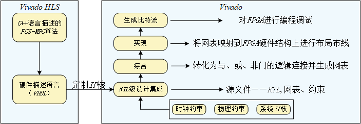
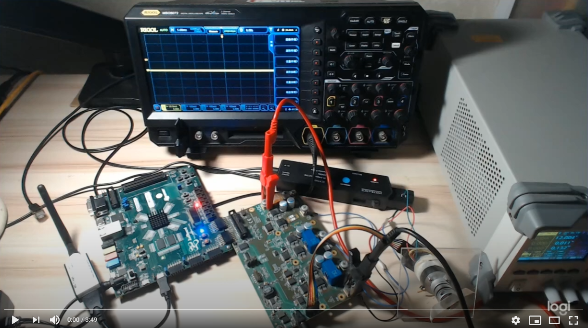

  
# PHASE 1. 使用Vivado HLS对PMSM模型预测控制算法加速

## CONTENT
- [PHASE 1. 使用Vivado HLS对PMSM模型预测控制算法加速](#phase-1-使用vivado-hls对pmsm模型预测控制算法加速)
  - [CONTENT](#content)
  - [1.1. FCS-MPC算法基本原理](#11-fcs-mpc算法基本原理)
  - [1.2. 延迟补偿及算法实现流程](#12-延迟补偿及算法实现流程)
  - [1.3. 使用Vivado HLS对FCS-MPC算法进行加速](#13-使用vivado-hls对fcs-mpc算法进行加速)
    - [1.3.1. Initial Optimizations](#131-initial-optimizations)
    - [1.3.2. Pipline for Performance](#132-pipline-for-performance)
    - [1.3.3. Optimize Structures](#133-optimize-structures)
    - [1.3.4. Reduce Latency](#134-reduce-latency)
    - [1.3.5. Improve Area](#135-improve-area)
- [PHASE 2.  VIVADO工程修改及上板验证](#phase-2--vivado工程修改及上板验证)
  - [2.1 修正电流采样信号链](#21-修正电流采样信号链)
  - [2.2 上板测试](#22-上板测试)

##  1.1. FCS-MPC算法基本原理

  根据控制量的不同, FCS-MPC可分为电流模型预测控制(MPCC)和转矩模型预测控制( MPTC). MPTC不但需要对转矩和磁链进行估测，还需要平衡转矩和磁链之间的控制性能，在价值函数中设置合适的加权因子，使MPTC灵活性受到影响。MPCC不需要对转矩和磁链进行估算和预测，计算量较小，可以通过提高采样频率或者增加预测步长提高系统性能. 本项目关注于单步电流模型预测控制算法的加速.

  d-q旋转坐标系永磁同步电机动态数学模型如下式所示：
  $$ \frac{d i_{d}(t)}{d t}=\frac{1}{L_{d}}\left(v_{d}(t)-R i_{d}(t)+\omega_{e}(t) L_{q} i_{q}(t)\right)\tag{1}$$

  $$\frac{d i_{q}(t)}{d t}=\frac{1}{L_{q}}\left(v_{q}(t)-R i_{q}(t)-\omega_{e}(t) L_{d} i_{d}(t)-\omega_{e}(t) \phi_{m g}\right)\tag{2}$$

  在$t_{i}$时刻，取时间间隔$\Delta$<sub>t</sub>使：
  
  $$\frac{d i_{d}(t)}{d t} \approx \frac{i_{d}\left(t_{i+1}\right)-i_{d}\left(t_{i}\right)}{\Delta t}\tag{3}$$

  $$
  \frac{d i_{q}(t)}{d t} \approx \frac{i_{q}\left(t_{i+1}\right)-i_{q}\left(t_{i}\right)}{\Delta t}
  \tag{4}$$

  将(3)、(4)分别带入(1)、(2)式中，可得：

  $$
  i_{d}\left(t_{i+1}\right)=i_{d}\left(t_{i}\right)+\frac{\Delta t}{L_{d}}\left(v_{d}\left(t_{i}\right)-R i_{d}\left(t_{i}\right)+\omega_{e}\left(t_{i}\right) L_{q} i_{q}\left(t_{i}\right)\right)
  \tag{5}$$

  $$
  i_{q}\left(t_{i+1}\right)=i_{q}\left(t_{i}\right)+\frac{\Delta t}{L_{q}}\left(v_{q}\left(t_{i}\right)-R i_{q}\left(t_{i}\right)-\omega_{e}\left(t_{i}\right) L_{d} i_{d}\left(t_{i}\right)-\omega_{e}\left(t_{i}\right) \phi_{m g}\right)
  \tag{6}$$

  为了便于编程实现，将(5)、(6)改写成下式形式：

  $$
  \left[\begin{array}{c}
  i_{d}\left(t_{i+1}\right) \\
  i_{q}\left(t_{i+1}\right)
  \end{array}\right]=\left(I+\Delta t A_{m}\left(t_{i}\right)\right)\left[\begin{array}{c}
  i_{d}\left(t_{i}\right) \\
  i_{q}\left(t_{i}\right)
  \end{array}\right]-\left[\begin{array}{c}
  0 \\
  \frac{\omega_{e}\left(t_{i}\right) \phi_{m g} \Delta t}{L_{q}}
  \end{array}\right]+\Delta t B_{m}\left[\begin{array}{c}
  v_{d}\left(t_{i}\right) \\
  v_{q}\left(t_{i}\right)
  \end{array}\right]
  \tag{7}$$

  其中

  $$
  A_{m}\left(t_{i}\right)=\left[\begin{array}{cc}
  -\frac{R_{s}}{L_{d}} & \frac{\omega_{e}\left(t_{i}\right) L_{q}}{L_{d}} \\
  -\frac{\omega_{e}\left(t_{i}\right) L_{d}}{L_{q}} & -\frac{R_{s}}{L_{q}}
  \end{array}\right]
  $$
  $$
  B_{m}=\left[\begin{array}{cc}
  \frac{1}{L_{d}} & 0 \\
  0 & \frac{1}{L_{q}}
  \end{array}\right]
  $$
  cost function采用下式形式：
  $$
  J(k)=\left(i_{d}(k)-i_{d}^{*}\right)^{2}+\left(i_{q}(k)-i_{q}^{*}\right)^{2}+\lambda_{u}\|\Delta u(k)\|_{1}
  \tag{8}$$


## 1.2. 延迟补偿及算法实现流程

  在非理想情况下，存在如下几种延迟：
  - Measurement delay:在EDDP中，该部分延迟主要由sinc3 filter引起，当ad7403的驱动时钟为20MHZ时，不同的抽取率引起的延迟如下表所示：
  <center>
  
  | Decimation Ratio(R) | Throught Rate(KHZ) | Effective Number of bit(ENOB) | Filter Delay(us) |
  | :-----------------: | :----------------: | :---------------------------: | :--------------: |
  |         256         |        78.1        |              12               |       12.8       |
  |         128         |       156.2        |              11               |       6.4        |
  |         32          |        625         |               9               |       1.6        |
  </center>
  由上表可知电流采样信号链延迟最低为1.6微秒。

  - Uplink communication delay:上行链路延迟，指测量结果传递至MPC计算单元的延迟，该部分延迟主要由clark变换IP核、park变换IP核引起。
  - Computation delay:计算延迟，该部分延迟主要由计算单元引起，未经HLS加速的MPC算法计算延迟为584us。
  - Downlink delay:下行链路延迟，MPC求解出的最优开关位置信号后经过SN74LVC1G97DCK/ADUM4224触发MOSFET动作引起的延迟。查询datasheet可得该部分延迟在200ns以下。
  通信和计算延迟通常为最重要的延迟。在数字控制器中，通常需要对延迟进行补偿。下图中U和D分别表示上行通信延迟和下行通信延迟，C表示MPC计算单元延迟。垂直箭头表示测量采样和开关实际作用的时间点。
  <center>

  
  </center>
  
  未补偿前，由于延迟时间的存在，使得本应在第k时刻作用于功率器件的开关组合U(K,K)却在第K+1时刻才作用于功率器件。这种开关位置作用时间的滞后，增加了电流纹波，降低了模型预测控制的闭环性能。为此，数字电路中，通常会引入额外的预测步长对延迟进行补偿。即，使用第k-1步的电流$i_{s}(k-1)$以及作用于k-1步的开关位置$U(k-1|k-2)$预测第k步的电流。
  $$
  \boldsymbol{i}_{s}(k \mid k-1)=\boldsymbol{A} \boldsymbol{i}_{s}(k-1)+\boldsymbol{B} \boldsymbol{u}(k-1 \mid k-2)
  \tag{9}$$
  根据上式，为模型预测算法增加额外的初始状态预测，具体预测步骤如下所示：

  1. 完成对第K-1步定子电流采样，并使用式9计算第k步的电流值$i_{s}(k|k-1)$。
  2. 进一步缩小第K步开关位置$U(K|K-1)$的开关位置范围。
  3. 对于候选$u(k|k-1)$使用式(8)计算J。
  4. 将对应最小价值函数$J_{min}$的$u_{opt}(k|k-1)$作用于逆变器。
  
  经延迟补偿的模型预测算法计算过程如下图所示：
  <center>

  
  </center>

## 1.3. 使用Vivado HLS对FCS-MPC算法进行加速

  模型预测控制算法的实现主要是在Vivado HLS和Vivado两个EDA设计工具中完成。首先由Vivado HLS部分完成模型预测控制算法部分进行加速，该部分完成的是实现C++高级语言到寄存器级硬件描述语言（Verilog）的转化，并将其封装成后续可进行图形化模块设计的IP核；然后在Vivado设计套件中完成矢量控制的基于IP核的模块化设计（Block Design）进而完成寄存器传输级（RTL）到比特流的FPGA设计。基于HLS的模型预测控制算法设计流程如下图所示。
  <center>

  
  </center>

  使用Vivado HLS对FCS-MPC算法加速分为如下步骤：
  1.  Initial Optimizations:初始优化，该部分的主要任务为定义接口
  2. Pipline for Performance：对loop和function进行流水线化处理，尽可能多的对数据进行并行处理，提升性能。
  3. Optimize Structures：优化结构，对RAM和port进行partition；清除错误依存关系。
  4. Reduce Latency：缩短时延
  5. Improve Area：改善面积，通过复用硬件资源来改善面积占用。
### 1.3.1. Initial Optimizations
  对算法进行仿真验证和综合完成之后，接下来首先要做的工作是定义接口。接口是指为顶层函数实参指定I/O协议。Vivado HLS支持两种接口协议：**Block Level Protocol**和**Port Level Protocol**。

  - **Block Level I/O Protocol** 该接口协议主要是为HLS block生成握手信号和控制信号。**Block Level Protocol**包含**ap_control_none** 、**ap_control_hs** 、**ap_control_chain**三种类型接口协议，其中ap_control_hs为默认设置。

  
    1. **ap_control_hs** 该接口协议通常包含如下接口信号：
        - **ap_start** 表示该功能模块何时开始处理数据
        - **ap_idle** 表示该功能模块何时处于空闲状态
        - **ap_done** 表示是否已经完成特定运算功能
        - **ap_ready** 表示何时该功能模块能够接收新的输入数据。
  
    2. **ap_control_chain** 该接口协议与ap_control_hs相似，只比ap_control_hs多一个ap_continue输入信号。当ap_continue信号为低电平时，表示下级block未准备就绪接收新的数据；暂停向下级bolck传输新的数据。
    3. **ap_control_none** 对接口应用该协议类型时，不会产生任何与该接口相关的控制信号。
  

- **Port Level I/O Protocol** 当使用Block level protocol对block实现控制之后，需要使用Port Level Protocol实现Block的数据传输。Port Level Protocol 包含：
  1.  AXI4 Interface Protocol
        - AXI4-Lite Interfaces(**s_axilite**)
        - AXI4-Master Interfaces(**m_axi**)
        - AXI4-Stream Interfaces(**axis**)
  2. No I/O Protocol
  3. Wire Handshake Protocol
  4. Memory Interface Protocol
  5. Bus Protocol

实际HLS项目工程中，对于**Block Level Protocol**部分的INTERFACE不使用任何Directive，综合后，HLS工具会为FCS-MPC Block缺省设置为**ap_control_hs**接口协议，对于输入端口缺省设置为**ap_none**协议，对于输出端口设置为**ap_vld**协议。故删除原设计中block level protocol部分所有directive，并使用Vivado_hls对FCS-MPC进行初步综合。综合后的interface summary如下图所示：
<center>


</center>
综合后的clock latency为585个时钟周期（100MHZ时钟，实际延迟为5.85us），如下图所示：
<center>

.png)
</center>
上板运行后，使用ILA测试BLOCK LEVEL PROTOCOL协议控制信号，FCS-MPC模块正常工作。未使用HLS加速前，FCS-MPC计算模块运行一个周期，即自ap_start高电平至ap_done高电平的下一时钟周期止，实际计算延迟为5.85us(1899-2484=585 cycle(100MHZ)),如下图所示：
<center>


</center>

原设计中FCS-MPC IP核只用了port level protocol，本设计使用axisream协议传输数据。原设计的.h文件中FCSMPC声明如下：
```
void FCSMPC(float R_over_L,				// quotient of phase resistance over phase inductance
			float one_over_L,			// inverse of the phase inductance
			float sampling_period,		// the sampling period of the synthesized FCSMPC Code
			uint16_t lm_over_c_i_sqr ,	// lamda_u divided by the conversion factor c_i squared
			int16_t	angle,				// angle of the motor in encoder steps (0 ... 999)
			int16_t	RPM,				// speed of the motor in rpm
			int16_t id_m,				// d component of the measured current
			int16_t	iq_m,				// q component of the measured current
			int16_t id_SP, 				// set point of the d component of the current
			int16_t iq_SP,				// set point of the q component of the current
			ap_int<3> *GH, 				// inverted Gate signals for the high side (bit layout 0bCBA)
			ap_int<3> *GL,				// inverted Gate signals for the low side (bit layout 0bCBA)
			int16_t *id_exp, 			// Output for debug purpose - what does the MPC predict
			int16_t *iq_exp);         // Output for debug purpose - what does the MPC predict)
```
添加HLS默认库hls_stream.h，并将上述声明的四个16位输入接口**angle**、**RPM**、**id_m**、**iq_m**整合为64位axis，做如下修改：
```
void FCSMPC(float R_over_L,				// quotient of phase resistance over phase inductance
			float one_over_L,			// inverse of the phase inductance
			float sampling_period,		// the sampling period of the synthesized FCSMPC Code
			uint16_t lm_over_c_i_sqr ,	// lamda_u divided by the conversion factor c_i squared
			hls::stream<int64_t> &s_axis,
			int16_t id_SP, 				// set point of the d component of the current
			int16_t iq_SP,				// set point of the q component of the current
			ap_int<3> *GH, 				// inverted Gate signals for the high side (bit layout 0bCBA)
			ap_int<3> *GL,				// inverted Gate signals for the low side (bit layout 0bCBA)
			int16_t *id_exp, 			// Output for debug purpose - what does the MPC predict
			int16_t *iq_exp
```
对FCSMPC.cpp文件做如下修改：
```
void FCSMPC(
      float R_over_L,				// quotient of phase resistance over phase inductance
			float one_over_L,			// inverse of the phase inductance
			float sampling_period,		// the sampling period of the synthesized FCSMPC Code
			uint16_t lm_over_c_i_sqr ,	// lamda_u divided by the conversion factor c_i squared
			hls::stream<int64_t> &s_axis,
			int16_t id_SP, 				// set point of the d component of the current
			int16_t iq_SP,				// set point of the q component of the current
			ap_int<3> *GH, 				// inverted Gate signals for the high side (bit layout 0bCBA)
			ap_int<3> *GL,				// inverted Gate signals for the low side (bit layout 0bCBA)
			int16_t *id_exp, 			// Output for debug purpose - what does the MPC predict
			int16_t *iq_exp){// Output for debug purpose - MPC prediction (conversion factor c_i applied)

	    int64_t in_data;
	    int16_t	angle;				// angle of the motor in encoder steps (0 ... 999)
	    int16_t	RPM;			// speed of the motor in rpm
	    int16_t id_m;				// d component of the measured current (conversion factor c_i applied)
	    int16_t	iq_m;				// q component of the measured current (conversion factor c_i applied)

	    in_data =s_axis.read();
    	id_m  = int16_t(in_data & 0xFFFF);
    	iq_m  = int16_t(in_data >> 16 & 0xFFFF );
    	RPM   = int16_t(in_data >> 32 & 0xFFFF );
      angle = int16_t(in_data >> 48 & 0xFFFF );
```
删除原directive，并做如下修改：
```
set_directive_interface -mode axis -register_mode off "FCSMPC" s_axis
```
对testbench.cpp部分做如下更改：
```
#include "FCSMPC_2.0.h"

int main(){
	ap_int<3> GH, GL;
	hls::stream<int64_t> inputStream;
	int64_t in_data;
	int16_t id_exp, iq_exp;
	int16_t id_in[] = {0,5,5,16,0,18,18,9,-13,-25,-27,-30,-17,-5,15},
			iq_in[] = {0,0,0,0,0,0,90,129,141,116,131,117,108,93,84},
			RPM[]   = {0,0,0,0,0,0,0,0,0,0,0,0,0,0,0},
			angle[] = {0,0,0,0,0,0,0,0,0,0,0,0,0,0,0};

	for(int idx = 0; idx < 15; idx++){
		in_data = (int64_t(id_in[idx]) & 0x0000FFFF) | ((int64_t(iq_in[idx]) << 16 ) & 0xFFFF0000) |((int64_t(RPM[idx]) << 32) & 0xFFFF00000000) | ((int64_t(RPM[idx]) << 48) & 0xFFFF000000000000);
		inputStream << in_data;
```
完成上述修改后，对FCS-MPC进行综合，Interface Summary如下图所示：
<center>


</center>

csynthssis之后，**angle**、**RPM**、**id_m**、**iq_m**输入接口已经整合为一个s_axi接口，资源占用情况和FCS-MPC的计算延迟与默认情况基本一致。

至此，第一部分Initial Optimizations已经完成。该部分完成两个主要工作：
1. 对输入输出接口进行了设置并添加控制信号(block level protocol)
2. 将四个16位输入端口整合为64位输入端口，并修改原代码，将输入端口设置为使用axistream传输数据。(port level protocol)

### 1.3.2. Pipline for Performance 

  完成第一步定义接口后，接下来需要对function和loop进行流水线化设计。实现高性能设计的关键在于使用PIPELINE和 DATAFLOW Directive来对函数、循环进行流水线化。在不使用流水线化的情况下，操作会顺序执行直至函数完成，然后才能开始执行函数的下一步操作或下一项传输事务。使用流水线时，一旦硬件资源变为可用，下一项传输事务就会即刻启动。流水线设计原理如下图所示：
  <center>

  
  </center>

  PIPELINE 指令可用于函数或循环，这样即可以最小的面积开销提升吞吐量 （最大限度缩短 II）。函数和循环均被视为任务。 DATAFLOW 指令用于将任务“流水线”化，使其在数据依赖关系允许的情况下并行执行。通过对代码中的功能和循环进行流水线处理，可以使设计的性能最大化。可用于流水线的指令如下表所示：
  |    指令和配置    |                                         描述                                         |
  | :--------------: | :----------------------------------------------------------------------------------: |
  |    INTERFACE     |                         指定如何根据函数描述创建 RTL 端口。                          |
  |    DATA_PACK     |                    把结构体的数据字段打包到字宽更宽的单一标量中。                    |
  |  LOOP_TRIPCOUNT  | 用于含变量边界的循环。提供估算的循环迭代计数。这对综合没有影响，只对报告功能有影响。 |
  | Config Interface |  该配置用于控制与顶层函数实参无关联的 I/O 端口，支持从最终RTL 中去除未使用的端口。   |


  在本阶段，应通过将PIPELINE指令应用于函数和循环，对于FCS-MPC执行并行操作的directive如下所示：
  ```
  set_directive_pipeline -enable_flush -rewind "FCSMPC/LOOP_CAL_Ud_Uq"
  set_directive_pipeline -enable_flush -rewind "FCSMPC/LOOP_CAL_DELTA_Id_Iq"
  set_directive_pipeline -enable_flush -rewind "FCSMPC/LOOP_CAL_SW_EFF"
  set_directive_pipeline -enable_flush -rewind "FCSMPC/LOOP_CAL_UK_OPT"
  ```
  最终实现的latency为下图所示：
  <center>

  
  </center>
  至此，第二步Pipline for performance已经完成。该部分主要是使用PIPLINE结合rewind和flush参数对for循环进行流水线化处理，另外使用DATAFLOW在各个for循环的function间使用fifo实现流水线操作，将整体延迟从5.84us降低至1.68us。

### 1.3.3. Optimize Structures

  在设计中尽可能多的创建流水线化后，需使用分析透视图来核查设计。如果流水线化不能满足所需性能时，需通过下表指令对结构进行最优化来提升性能：
  |       指令和配置       | 描述                                                                                                   |
  | :--------------------: | ------------------------------------------------------------------------------------------------------ |
  |    ARRAY_PARTITION     | 把大型数组分区为多个较小数组或分区为单独的寄存器，以改善数据访问并消除块RAM 瓶颈。                     |
  |       DEPENDENCE       | 用于提供附加信息，这些信息可用于克服循环附带的依赖关系并支持循环流水线化（或以较低时间间隔流水线化）。 |
  |         INLINE         | 内联函数，消除所有函数层级。用于跨越函数边界实现逻辑最优化，通过减少函数调用开销来改善时延/时间间隔。  |
  |         UNROLL         | 展开 for 循环，创建多个独立操作而非单个操作集。                                                        |
  | Config Array Partition | 该配置用于判断包括全局数组在内的数组分区方式，以及分区是否会影响数组端口。                             |
  |     Config Compile     | 控制综合专用最优化功能，例如自动循环流水线化和浮点运算最优化。                                         |
  |    Config Schedule     | 判断综合调度阶段的工作量以及输出消息的详细程度，并指定是否应在流水线化任务中放宽 II 以实现时序收敛。   |
  |     CONFIG_UNROLL      | 允许自动展开低于指定循环迭代次数的所有循环.                                                            |

  对for循环进行pipline后的synthsis report的loop latency中的**CAL_SW_EFF_LOOP**和**CAL_J_LOOP**的启动时间间隔（II)均未达到1，如下图所示：
  <center>

  
  </center>

  使用分析透视图核查设计后，可知，在**CAL_SW_EFF_LOOP**中，sw_eff++读加操作需要两个时钟周期：
  <center>

  
  </center>
  对于sw_eff[8]使用array_partition指令：

  ```
  set_directive_array_partition -type complete -dim 1 "FCSMPC" sw_eff
  ```

  综合后，CAL_SW_EFF_OUTER_loop ii=1, loop summary如下图所示：
  <center>

  
  </center>

  同样，对影响**CAL_J_LOOP**的数组J[]应用array_partition指令：
  
  ```
  set_directive_array_partition -type complete -dim 1 "FCSMPC" J
  ```
  最终loop summary如下图所示：
  <center>

  
  </center>

  lantency 如下图所示：
  <center>

  
  </center>

  timing summary如下图所示：

  <center>

  
  </center>

  对**CAL_SW_EFF_OUTTER_LOOP**和**CAL_SW_EFF_INNER_LOOP**使用如下指令将循环展开：
  ```
  set_directive_unroll "FCSMPC/CAL_SW_EFF_OUTTER_LOOP"
  set_directive_unroll "FCSMPC/CAL_SW_EFF_INNER_LOOP"
  ```
  使用上述指令综合后，timing满足设计要求：
  <center>

  
  </center>

  至此本节设计完成。该部分主要使用了array partition指令和loop unroll指令来分别对启动时间间隔和timming latency来进行优化，优化结果满足性能要求。
### 1.3.4. Reduce Latency

  当 Vivado HLS 完成最大程度缩短启动时间间隔后，会自动尽可能缩短时延。下表中列出了有助于缩短时延或指定特定时间的最优化指令。


  |     指令     | 描述                                                     |
  | :----------: | -------------------------------------------------------- |
  |   LATENCY    | 允许指定最小和最大时延约束。                             |
  | LOOP_FLATTEN | 允许把嵌套循环折叠为已改善时延的单一循环                 |
  |  LOOP_MERGE  | 合并连续循环，以缩短总体时延、增加共享和提升逻辑最优化。 |

   在循环和函数流水线化时一般无需使用这些指令，因为在大多数应用中时延并非关键，通常吞吐量才是关键。如果循环和函数未流水线化，则吞吐量将受到时延限制，因为只有在上一个任务完成后，下一个任务才会开始读取下一组输入。本设计并不适用上述指令，故舍去该步骤的优化。


### 1.3.5. Improve Area

  在满足所需性能目标 （或 II）后，下一步是在保持性能不变的情况下缩小面积。
  如果已使用 **DATAFLOW** 最优化且 Vivado HLS 无法判定设计中的任务是否在流送数据，那么Vivado HLS会使用乒乓缓存 (**ping-pong buffer**) 来实现数据流任务之间的存储器通道。如果设计已完成流水线化且数据正在从一个任务流送到下一个任务，那么使用数据流配置 **config_dataflow** 把默认存储器通道中使用的乒乓缓存转换为 FIFO 缓存即可显著缩小面积。随后可把 FIFO 深度设置为需要的最小值。

  数据流配置 **config_dataflow** 可指定所有存储器通道的默认实现方式。您可以使用 **STREAM** 指令指定哪些单独的数组将实现为块RAM以及哪些数组将实现为 FIFO。
  最大程度减少设计实现所使用的资源时，可尝试使用如下指令:

  |      指令       | 描述                                                                                                 |
  | :-------------: | ---------------------------------------------------------------------------------------------------- |
  |   ALLOCATION    | 指定所使用的操作、核或函数的数量限制。这样会强制共享硬件资源并可能增大时延。                         |
  |    ARRAY_MAP    | 把多个较小的数组结合成单个大型数组以帮助减少块 RAM 资源数量。                                        |
  |  ARRAY_RESHAPE  | 把数组从多元素数组重塑为字宽更宽的数组。用于在不增加使用的块 RAM 数量的前提下提升块 RAM 访问。       |
  |   LOOP_MERGE    | 合并连续循环，以缩短总体时延、增加共享和提升逻辑最优化。                                             |
  |   OCCURRENCE    | 在对函数或循环进行流水线化时使用，用于指定某个位置的代码执行速度低于外围函数或循环中的代码执行速度。 |
  |    RESOURCE     | 指定将特定的库资源 （核）用于实现 RTL 中的变量 （数组、算术运算或函数实参）。                        |
  |     STREAM      | 指定在数据流最优化期间把特定存储器通道实现为 FIFO 或 RAM。                                           |
  |   Config Bind   | 判断综合绑定阶段的工作量，可用于在全局层面最大限度减少使用的运算数量。                               |
  | Config Dataflow | 该配置用于指定数据流最优化中的默认内存通道和 FIFO 深度。                                             |

  尝试使用ARRAY_RESHAPE指令代替ARRAY_PARTITION指令综合后， 延迟、资源占用率均明显增加，故舍弃。
  使用dataflow指令应用于顶层函数，综合后资源占有率稍有下降:
  <center>

  
  </center>

  故本设计中最终使用的全部directive为：

  ```
  set_directive_pipeline -enable_flush -rewind "FCSMPC/CAL_UD_UQ_LOOP"
  set_directive_pipeline -enable_flush -rewind "FCSMPC/CAL_ID_IQ_LOOP"
  set_directive_pipeline -enable_flush -rewind "FCSMPC/CAL_J_LOOP"
  set_directive_interface -mode axis -register -register_mode both "FCSMPC" s_axis
  set_directive_array_partition -type complete -dim 1 "FCSMPC" sw_eff
  set_directive_array_partition -type complete -dim 1 "FCSMPC" uk_pos
  set_directive_array_partition -type complete -dim 1 "FCSMPC" J
  set_directive_unroll "FCSMPC/CAL_SW_EFF_OUTTER_LOOP"
  set_directive_unroll "FCSMPC/CAL_SW_EFF_INNER_LOOP"
  set_directive_dataflow "FCSMPC"
  ```
  最后实现的加速性能参数如下：
  **Timing：**
  <center>

  
  </center>

  **Latency:**
  <center>

  
  </center>

  **Utilization Estimates:**
  <center>

  
  </center>
  至此，使用Vivado HLS对模型预测控制算法进行加速工作已经全部完成。优化加速后，FCSMPC算法功能模块的启动时间(II)由原来的585 cycle降低至125 cycle，性能提升4.57倍。即，优化后，FCSMPC算法功能模块每运行一次需要128个cycle，thoughtput为100M/128=781.25K Sample/Second.

#  PHASE 2.  VIVADO工程修改及上板验证

  ##  2.1 修正电流采样信号链
  在电机运行过程中，经JTAG与FPGA建立连接后，使用ILA获取AD7403输出信号，获得12位(H)共16384组数据。该数据从最高位至最低位依次为 ：未定义(4位）、vbus（4位）、Ib（4位）、Ia（4位）对上述数据初步处理，删除前八位后，取后8位（H）数据待用。使用matlab对上述数据处理：

  ```
  b=hex2bin(a)
  b1(:,1:16)=b(:,1:16)
  b2(:,1:16)=b(:,17:32)
  N=16
  parfor k=1:8192
  Ib(k,1)=bin2decsig(b1(k,1:16))
  end
  parfor j=1:8192
  Ia(j,1)=bin2decsig(b2(j,1:16))
  end
  ```
  整理数据后，简单计算求得ib直流增益为19.8840，ia直流增益为240.4093。
  获得Ia、Ib数据后需要使用matlab对获得数据进行拟合。首先对Ia去除直流分量，然后对IA_DEC使用如下公式进行拟合：
  $$
  y=a_{1} * \sin \left(b_{1} x+c_{1}\right)
  \tag9$$
  Ia拟合结果如下：
  ```
General model Sin1:
     f(x) =  a1*sin(b1*x+c1)
Coefficients (with 95% confidence bounds):
       a1 =       472.9  (472.5, 473.3)
       b1 =   0.0003906  (0.0003904, 0.0003908)
       c1 =      -3.103  (-3.104, -3.101)
  ```
  具体拟合效果及拟合优度如下图所示：
  <center>

  
  </center>

  同理，可得Ib拟合结果：
  ```
General model:
     f(x) = 472.9*sin(0.0003906*x+c)
Coefficients (with 95% confidence bounds):
       c =       1.089  (1.088, 1.09)
  ```

  接下来对示波器同步获取数据进行处理。在上步使用ILA对ad7403采样的同时使用示波器获取电机相电流。
  <center>

  
  </center>

  将使用示波器获取的数据进行降采样（降采样系数50）、裁剪（剪除0.2s后的数据）后，使用matlab分两次进行拟合。
  
  首先使用sum of sine 对数据进行拟合。未加直流增益的拟合结果如下所示：
  ```
General model Sin1:
     f(x) =  a1*sin(b1*x+c1)
Coefficients (with 95% confidence bounds):
       a1 =       1.408  (1.405, 1.41)
       b1 =       38.97  (38.96, 38.98)
       c1 =      0.2843  (0.2825, 0.2861)

Goodness of fit:
  SSE: 60.62
  R-square: 0.9932
  Adjusted R-square: 0.9932
  RMSE: 0.08245
```

在上述获得的系数基础上引入直流增益C再次拟合，获得最终结果如下图所示
：
<center>


</center>

```
General model:
     f(x) = 1.408*sin(38.97*x+0.2843)+c
Coefficients (with 95% confidence bounds):
       c =    -0.07822  (-0.07876, -0.07768)

Goodness of fit:
  SSE: 6.042
  R-square: 0.9993
  Adjusted R-square: 0.9993
  RMSE: 0.02603
```

综合ILA和示波器获得的数据可得该开发板电流采样信号链A-D为：

设ad7403输出电流数值为ia_digi,设实际电流值为ia_osc,则
```
ia_osc=((ia_digi-240.4093)/472.9)*1.408(A)
```
同理，设ad7403输出电流值为ib_digi,设实际电流值为ib_osc,则
```
ib_osc=((ib_digi-19.8840)/472.9)*1.408（A)
```

  ## 2.2 上板测试
  [](https://youtu.be/ZH6ED-wAIwY "测试视频")
  
